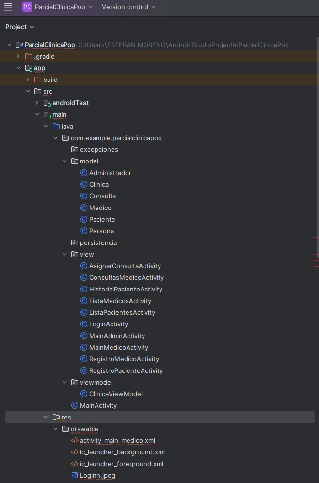
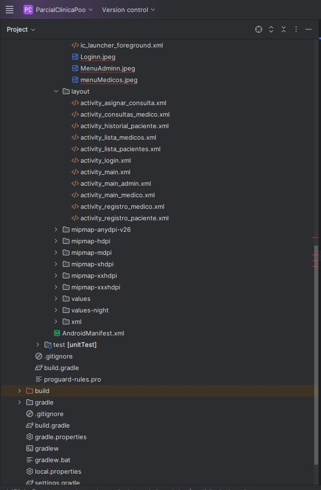
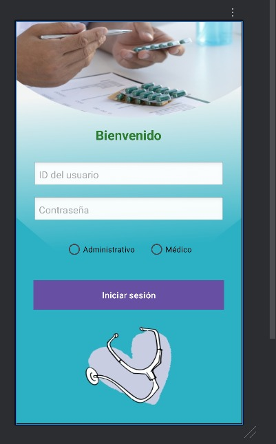
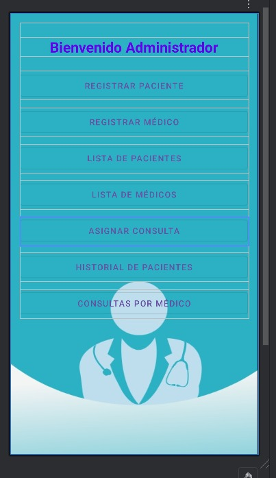
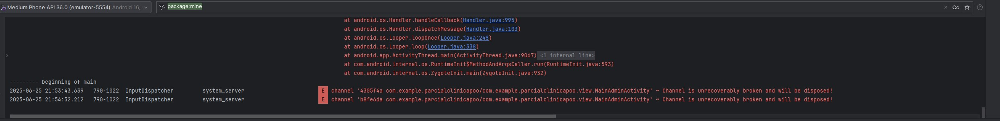

# Parcial POO-2   Clínica - Gestión de Consultas Médicas
### Resumen
Clínica POO es una aplicación Android desarrollada en Java que permite gestionar el funcionamiento básico de una clínica médica. Está diseñada bajo el paradigma de programación orientada a objetos (POO), y permite a dos tipos de usuarios —Administrativos y Médicos— interactuar con el sistema según su rol.

Entre sus funcionalidades principales se encuentran el registro de pacientes y médicos, la asignación de consultas, y la visualización del historial médico de los pacientes. La aplicación incluye un sistema de login con control de acceso por rol, una interfaz organizada y una persistencia de datos local para mantener la información entre sesiones.

###  Características

-  Login para Médicos y Administrativos
-  Registro de pacientes y médicos
-  Lista de usuarios registrados
-  Asignación de consultas
-  Historial de pacientes
-  Consultas filtradas por médico

### Estructura del proyecto

### interfaz grafica principal del proyecto

### paso a paso de creacion de codigo para proyecto

creamos un proyecto y con ellos creamos los paquetes mas importantes con sus respectivas clases y layouts.

 model        // Clases: Paciente, Medico, Consulta, Administrador
 
 view         // Activities (LoginActivity, MainAdminActivity, etc.)
 
 viewmodel    // Clase ClinicaViewModel (Singleton)

Se diseñaron diferentes interfaces (.xml) en la carpeta res/layout para:

-Login (activity_login.xml)

-Menú de administrador (activity_main_admin.xml)

-Menú de médico (activity_main_medico.xml)

-Registro de pacientes y médicos

-Listados y consultas

### verificacion de cumplimiento de tareas designadas

### resultados

Al colocar los fondos de los layouts para una visualizacion mas amena y moderna sucedio un error con el archivo y por falta de tiempo no se pudo solucionar pero se tiene constancia que el codigo sirve, adjuntamos foto. Este error ocurre cuando se intenta iniciar una `Activity` desde un Intent, pero dicha Activity **no está declarada en el archivo `AndroidManifest.xml`**. Android no puede encontrarla, aunque exista en el código.

